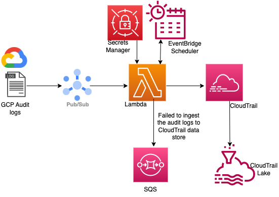

# Ingesting Google Cloud Audit Logs to CloudTrail Lake


## Introduction
A reference architecture to ingest Cloud Audit Logs from Google Cloud to AWS CloudTrail Lake. The solution uses a Lambda function to poll the Pub/Sub subscription, transform incoming Cloud Audit Log events, and send them to a CloudTrail Lake channel. Any Google Cloud Audit Log events which fail to be ingested are sent to a SQS queue.




## Getting Started


### General prerequisites

This solution requires the following resources:
- An AWS account with an AWS Identity and Access Management (IAM) role that has sufficient access to provision the required resources.
- SAM CLI installed.
- A Google Cloud account that has sufficient access to provision the required resources and has access to the Cloud Audit Logs.


### Prepare Google Cloud resources

* Follow the instructions to create a Google Pub/Sub topic: [Create and manage topics](https://cloud.google.com/pubsub/docs/create-topic)
* Add Pub/Sub Subscriber and Pub/Sub Publisher roles to the topic by following the steps here: [Controlling access through the Google Cloud console](https://cloud.google.com/pubsub/docs/access-control#console)
* Follow the instructions to create a pull subscription for the topic: [Create pull subscriptions](https://cloud.google.com/pubsub/docs/create-subscription)
* Create a sink to forward Cloud Audit Logs to the Pub/Sub topic: [Create a sink](https://cloud.google.com/logging/docs/export/configure_export_v2#creating_sink)
  * **Note**: In order to capture only Cloud Audit logs, enter below filter expression in the *Build inclusion filter* field:
  `protoPayload."@type"="type.googleapis.com/google.cloud.audit.AuditLog"`
* Create service account using the Identity and Access Management (IAM) by following the steps here: [Create service accounts](https://cloud.google.com/iam/docs/service-accounts-create)
* Generate a service account key by following these instructions: [Create and delete service account keys](https://cloud.google.com/iam/docs/keys-create-delete#creating)
  * **Note**: You will need to store the generated JSON-formatted credentials in an AWS Secrets Manager. You can follow these steps to create a secret: [Create an AWS Secrets Manager secret](https://docs.aws.amazon.com/secretsmanager/latest/userguide/create_secret.html). When creating the secret, you can paste the JSON-formatted credentials as a plaintext value and Secrets Manager will automatically parse the JSON key/value pairs.


 
## Solution Overview

You can use CloudTrail Lake integrations to log and store user activity data from outside of AWS;
from any source in your hybrid environments, such as in-house or SaaS applications hosted on-
premises or in the cloud, virtual machines, or containers. After you create an event data store in
CloudTrail Lake and create a channel to log activity events, you call the PutAuditEvents API to
ingest your application activity into CloudTrail. You can then use CloudTrail Lake to search, query,
and analyze the data that is logged from your applications.

In this workflow, Google Cloud Audit Logs are routed to the Pub/Sub topic through the Log Router sink
configuration. Lambda pulls the logs from the pub/sub topic using the code logic and the
subscription details, to parse and transform them to the CloudTrail format. Then you can leverage
CloudTrail Lake to run SQL-based queries on your events for various customer use cases.

To follow along with this example, we will perform these high-level steps:
1. Create a Google Pub/Sub topic, necessary roles, and a pull subscription.
2. Configure a log router sink to forward Cloud Audit Logs to the topic.
3. Create a Google service account which has access to the pull subscription.
4. Store the Google service account key in [AWS Secrets Manager](https://aws.amazon.com/secrets-manager/) secret.
5. Deploy the example solution in your AWS account using SAM CLI. This will create the following resources:
   * CloudTrail event data store to store the ingested Google Cloud Audit Log events. ***Note:*** *This resource will only be created if an existing event data store ARN is not provided during deployment.*
   * CloudTrail Lake channel which is associated with the event data store and will be
   referenced when calling the PutAuditEvents API.
   * Lambda function and necessary IAM role to poll the Google subscription and
   ingest Google Cloud Audit Logs to a CloudTrail event data store.
   * EventBridge scheduled event to trigger the Lambda function every 5 minutes.   
   * SQS FIFO (First-In-First-Out) queue where we will forward any Google Cloud
   Audit Log events that could not be ingested into CloudTrail Lake for any reason.
6. Query your Google Cloud Audit Log events using CloudTrail Lake and SQL-based queries.


## Step-by-Step Instructions

To use the SAM CLI and deploy this example, you need the following tools installed:
* SAM CLI - [Install the SAM CLI](https://docs.aws.amazon.com/serverless-application-model/latest/developerguide/serverless-sam-cli-install.html)
* [Python 3.9 or greater installed](https://www.python.org/downloads/)

### Deploy using SAM CLI

1. Use git to clone this repository to your workspace area. SAM CLI should be configured with AWS credentials from the AWS account where you plan to deploy the example. Run the following commands in your shell:
```bash
git clone https://github.com/aws-samples/ingesting-non-aws-resources-to-cloudtrail-lake.git
cd ingesting-non-aws-resources-to-cloudtrail-lake/SAM
sam build
sam deploy --guided
```

2. Provide values for the required parameters.
   * `CloudTrailEventDataStoreArn` (**Optional**) – Arn of the event data store into which the Google Cloud Audit Logs will be ingested. If no Arn is provided, a new event data store will be created. 
   > Please be aware that there is a quota on the number of event data stores that can be created per region. See [Quotas in AWS CloudTrail](https://docs.aws.amazon.com/awscloudtrail/latest/userguide/WhatIsCloudTrail-Limits.html) for more details. Additionally, after you delete an event data store, it remains in the `PENDING_DELETION` state for seven days before it is permanently deleted, and continues to count against your quota. See [Manage event data store lifecycles](https://docs.aws.amazon.com/awscloudtrail/latest/userguide/query-eds-disable-termination.html) for more details.
   * `CloudTrailEventRetentionPeriod` – The number of days to retain events ingested into CloudTrail. The minimum is `7` days and the maximum is `2557` days. Defaults to `7` days.
   * `GCPPubSubProjectName` – The project ID or project number, available from the Google Cloud console, to which the Pub/Sub subscription belongs.
   * `GCPPubSubSubscriptionName` – The name of the pull subscription created for the Pub/Sub topic where Cloud Audit Logs are delivered.
   * `GCPCredentialsSecretName` – The name of the AWS Secrets Manager secret which contains the Google Cloud service account key in JSON format. 
   > Please note that this secret value will be stored in an environment variable in the Lambda function and will be visible in plaintext when describing the function's properties.
   * `MaxMessagesPerRead` – Maximum number of messages to read when polling the Pub/Sub subscription. The minimum is `1` and maximum is `10000`. Defaults to `500` messages.
   * `ReadTimeout` – The maximum time in seconds to wait for a message when polling the Pub/Sub subscription. Defaults to `10` seconds.
   * `UserType` – The value assigned to the `userIdentity.type` field for all events ingested into CloudTrail. Defaults to `GoogleCloudUser`.
<br/><br/>
3. After SAM has successfully deployed the example, check the outputs and note the `EventDataStoreId` value that is returned. This Id will be needed to query the CloudTrail Lake event data store.
4. The Lambda function will have a scheduled trigger attached to invoke the function every 5 minutes. After the example is deployed successfully, the function should be automatically invoked for the first time within 5 minutes. 

    Either invoke the function manually, or verify that it has been invoked at least once by navigating to the AWS Lambda Console and looking at the Invocations graphs on the Monitoring tab. For more details, see Monitoring functions on the Lambda console.
5.	After the Lambda function has been invoked, you can follow the steps below to analyze your Google Cloud Audit Logs using the CloudTrail Lake SQL-based sample queries.

> **NOTE**<br/>
> CloudTrail typically delivers events within an average of about 5 minutes of an API call, though this time is not guaranteed. Therefore, after the Lambda function is invoked there may be an additional delay of about 5 minutes before the events can be queried in CloudTrail Lake. 

In the event that the Lambda function encounters any issues during the ingestion of Google Cloud Audit Log events into CloudTrail, the root cause should be identifiable by inspecting the CloudWatch logs for the function. For more information, see [Accessing Amazon CloudWatch logs for AWS Lambda](https://docs.aws.amazon.com/lambda/latest/dg/monitoring-cloudwatchlogs.html). 


### Validating the setup

To verify if audit logs are available in AWS CloudTrail Lake data store, use the sample query below to query your 
CloudTrail Lake event data store following these instructions: [Run a query and save query results](https://docs.aws.amazon.com/awscloudtrail/latest/userguide/query-run-query.html). 

Make sure you replace `<event data store id>` with the Id of the event data store, which can be found in the Outputs returned after a successful deployment with SAM. 

Also replace `GoogleCloudUser` with the value that was entered in the `UserType` parameter supplied to SAM CLI.

Finally, ensure the dates are updated to encompass a period following the deployment of the Lambda function.
```sql
SELECT
   eventData.eventSource,    
   eventData.eventName, 
   eventData.userIdentity.principalId,
   eventData.sourceIpAddress, 
   eventData.eventTime
FROM
   <event data store id>
WHERE
   eventData.userIdentity.type = 'GoogleCloudUser'
   AND eventData.eventTime >= '2023-06-28 00:00:00' 
   AND eventData.eventTime < '2023-07-01 00:00:00'
LIMIT 10
```


## Cleaning Up

You can use SAM CLI to delete the deployed resources and make sure that you don’t continue to incur charges. To delete the resources, run the following command from your shell and replace `<stack-name>` with the stack name you provided to SAM when running `sam deploy`. Follow the prompts to confirm the resource deletion.

```bash
sam delete --stack-name <stack-name>
```

You can also delete the CloudFormation stack created by the SAM CLI from the console by following [these steps](https://docs.aws.amazon.com/AWSCloudFormation/latest/UserGuide/cfn-console-delete-stack.html).


## Additional Information
To learn more about CloudTrail Lake, check out the [CloudTrail Lake documentation](https://docs.aws.amazon.com/awscloudtrail/latest/userguide/cloudtrail-lake.html) and [AWS blogs related to CloudTrail Lake](https://aws.amazon.com/blogs/mt/tag/aws-cloudtrail-lake/).